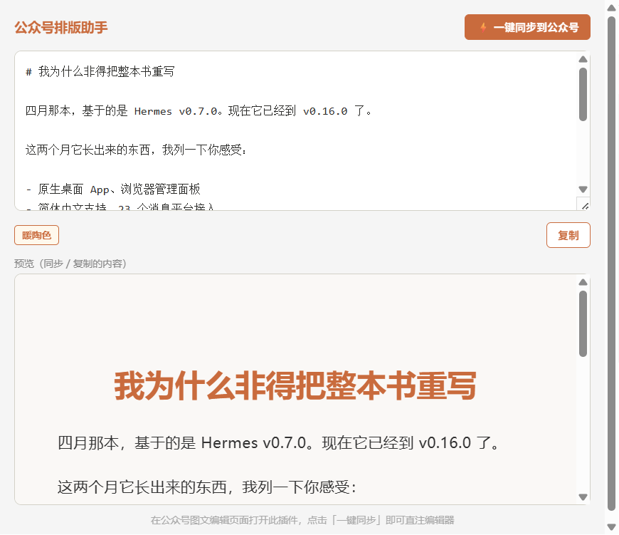

# WeChat Article Formatter

> Markdown → WeChat articles with one click. Chrome Extension bypasses the platform's paste filter by injecting HTML directly into the editor DOM. Built-in AI rewriting and smart formatting.



## The Problem

WeChat's editor aggressively sanitizes pasted HTML — backgrounds, code blocks, border-radius, even `<div>` tags are silently stripped. Clipboard-based tools have no control over what survives.

## The Solution

A Chrome Extension (Manifest V3) that formats Markdown into WeChat-safe inline HTML and injects it **directly into the editor DOM** via `chrome.scripting.executeScript`. Plus optional AI-powered style rewriting and automatic template card insertion.

## Features

- **⚡ One-click sync** — injects HTML straight into the WeChat article editor DOM
- **🤖 AI Rewrite** — 6 style presets (narrative, technical, academic, blog, social, polish) + custom prompt. OpenAI-compatible API (DeepSeek, Kimi, OpenAI)
- **🎨 Smart Format** — AI analyzes article content and automatically inserts template cards (data highlights, callout boxes, quote blocks, comparison grids)
- **📋 Template Library** — 20 pre-built WeChat-safe HTML modules across 9 categories, one-click send to format preview
- **📊 GFM Tables** — full Markdown table support with zebra-striped styling
- **🔥 Warm Theme** — Anthropic-Tech design system: 34px H1, Mac Terminal code blocks, callout cards
- **Zero dependencies** — pure HTML/CSS/JS, no build step, no framework
- **Standalone fallback** — `wechat-formatter.html` works offline for clipboard-based workflow

## Quick Start

### Chrome Extension (recommended)

1. Navigate to `chrome://extensions/`, enable **Developer mode**
2. Click **Load unpacked** → select the project directory
3. Open `mp.weixin.qq.com` and start editing an article
4. Click the extension icon → write Markdown → click **⚡ Sync**

### AI Features Setup

Click ⚙️ in the extension header, configure:
- **API Base URL** — e.g. `https://api.deepseek.com/v1`
- **API Key** — your provider key
- **Model** — model ID (e.g. `deepseek-chat`, `kimi-k2.6`)
- **Temperature** — `0.7` for most models, `1` for Kimi K2.6

> If switching API providers, you may need to add their domain to `host_permissions` in `manifest.json` and reload the extension.

### Standalone Page

Open `wechat-formatter.html` in your browser → edit → copy → paste. (No AI features in standalone mode.)

## WeChat Compatibility

| Used (safe) | Avoided (stripped by WeChat) |
|---|---|
| `section` `table` `p` `blockquote` `h1-h3` | `div` `pre` |
| `border` `background` `border-radius` | `max-width` `box-shadow` `overflow:hidden` |
| `innerHTML` (DOM injection) | `execCommand('insertHTML')` (paste handler) |

## Project Structure

```
├── manifest.json              # Chrome Extension (MV3)
├── popup.html / popup.js      # Extension popup — 3 tabs (Rewrite / Format / Templates)
├── icon.svg                   # Extension icon
├── wechat-formatter.html      # Standalone version (no AI, no templates)
└── docs/plans/                # Design documents
```

## License

MIT
